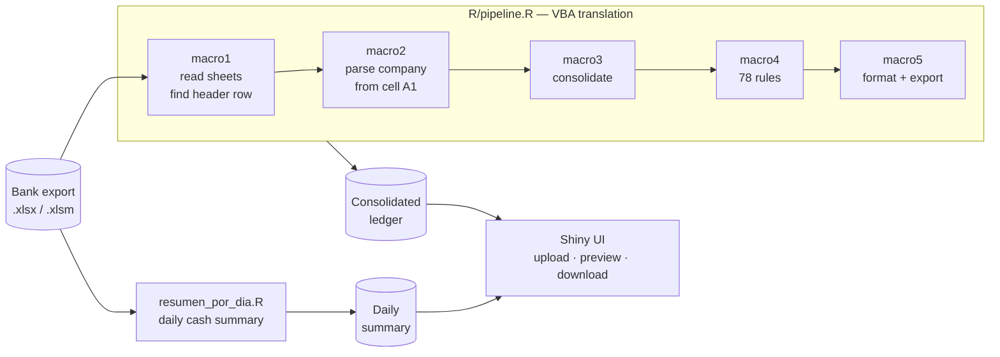

# Bank Statement Consolidator

> An Excel VBA macro that finance ran by hand every month, rebuilt as an R/Shiny
> application. Six bank accounts, one consolidated ledger, 78 classification rules.
> Built at a real estate and media group in Mexico.
> **Anonymized portfolio version — all data is synthetic.**

 

---

## The problem

Finance received one Excel workbook per month from the bank, with a separate sheet for
each of the group's accounts. Before anyone could look at cash flow, somebody had to open
the file, strip the bank's summary rows out of every sheet, paste the sheets together,
read the company name out of a header cell, and then tag each movement by hand so the
ledger matched the chart of accounts.

It was a VBA macro nobody could safely change plus a lot of manual cleanup, and it had to
happen before the monthly close.

## What I built

A Shiny application that takes the same workbook and returns the consolidated, classified
ledger plus a day-by-day cash summary. The VBA was translated rule by rule so the output
reconciles against the old process — that was the acceptance criterion, not elegance.

| | |
|---|---|
| **Stack** | R 4.5 · Shiny · readxl · openxlsx · dplyr |
| **Input** | One multi-sheet bank export (one sheet per account) |
| **Output** | Consolidated ledger + daily cash summary, both as Excel |
| **Scale** | 6 accounts, ~525 movements/month in the demo; the real deployment runs 30+ accounts |
| **Outcome** | A monthly manual step became a file upload |

---

## Architecture



The bank export is not a clean table. Each sheet carries a title block of unpredictable
height, summary rows with no account number, and zero-value foreign-currency lines. The
pipeline handles all three before any business logic runs.

---

## Design decisions

### The header row is found, not assumed

The original macro hard-coded `A14`. That broke whenever the bank added a line to the
title block. Instead, `detectar_fila_inicio()` scans the first 25 rows and returns the
first one where at least two expected column names appear — after stripping accents, so
`DESCRIPCIÓN` and `DESCRIPCION` both match. Row 14 is only the fallback.

### Rules are ordered, and later rules win

The 78 rules run as a sequence of independent `if` statements rather than `if/else`, so a
later, more specific rule overwrites an earlier general one. That is how the VBA behaved,
and changing it would have changed the numbers. Preserving a quirk you can explain beats
improving it into a mismatch.

### Columns are matched by name, not position

The original indexed columns 6 and 13. Any change in the export shifted every rule at
once. Here the two description columns are located by name, with the accented and
unaccented spellings both accepted.

### Logic is separated from the UI

`R/pipeline.R` has no Shiny dependency, so the whole thing runs headless
(`scripts/run_demo.R`) and can be tested without a browser. `app.R` is only the front end.
This is the one structural change made to the original.

### The opening balance has an explicit fallback — and says so

The daily summary needs each account's opening balance. The authoritative source is a
`Saldo Inicial` sheet. When it is missing, the code estimates from each statement's
header instead and **surfaces a warning in the UI** explaining that the estimate is the
balance at the start of the last day downloaded, not of the period. A silent estimate
here would produce a plausible, wrong cash position.

---

## Run it locally

No credentials, no database, no network.

```bash
git clone https://github.com/chino-bot1701/bank-statement-consolidator.git
cd bank-statement-consolidator

pip install openpyxl                          # generator only
python fixtures/generate_demo_statement.py    # writes fixtures/demo_statement.xlsx

Rscript -e 'install.packages(c("shiny","shinyjs","readxl","openxlsx","dplyr","stringr"))'
Rscript scripts/run_demo.R                    # headless, prints a summary
```

Expected output:

```
  sheets recognised as accounts: 1101, 1102, 1103, 1104, 1105, 1106
  rows consolidated: 525 | columns: 14

Classification (525 rows):
  COBRANZA                 144
  SERVICIOS                 71
  INVERSIONES               59
  IMPUESTOS                 39
  ...
  [unclassified]             0  (0.0%)

Running daily summary module...
  accounts covered: 6
  days in period  : 22
```

For the full application:

```bash
Rscript -e 'shiny::runApp(port = 8080)'
```

Upload `fixtures/demo_statement.xlsx` in the browser.

---

## Repository layout

```
app.R                              Shiny UI + server
R/pipeline.R                       macros 1–5: read, consolidate, classify, export
R/resumen_por_dia.R                daily cash summary (the second VBA routine)
scripts/run_demo.R                 headless end-to-end run
fixtures/generate_demo_statement.py  synthetic bank export generator
fixtures/demo_statement.xlsx       generated sample input
```

---

## Notes on anonymization

This is a real production tool, rewritten for public release:

- Company names, accounts, amounts, references and counterparties are **invented**.
  `fixtures/generate_demo_statement.py` builds them from a fixed seed.
- The bank and the branded counterparties in the classification rules are replaced.
  Mexican public institutions and tax concepts (CFE, municipal water, IMSS, IVA, ISR,
  SPEI) are kept as-is: they identify nobody and removing them would make the rules
  unreadable.
- No credentials exist in this project — it never connects to anything.

The pipeline, the rules and the engineering decisions are the real ones.
